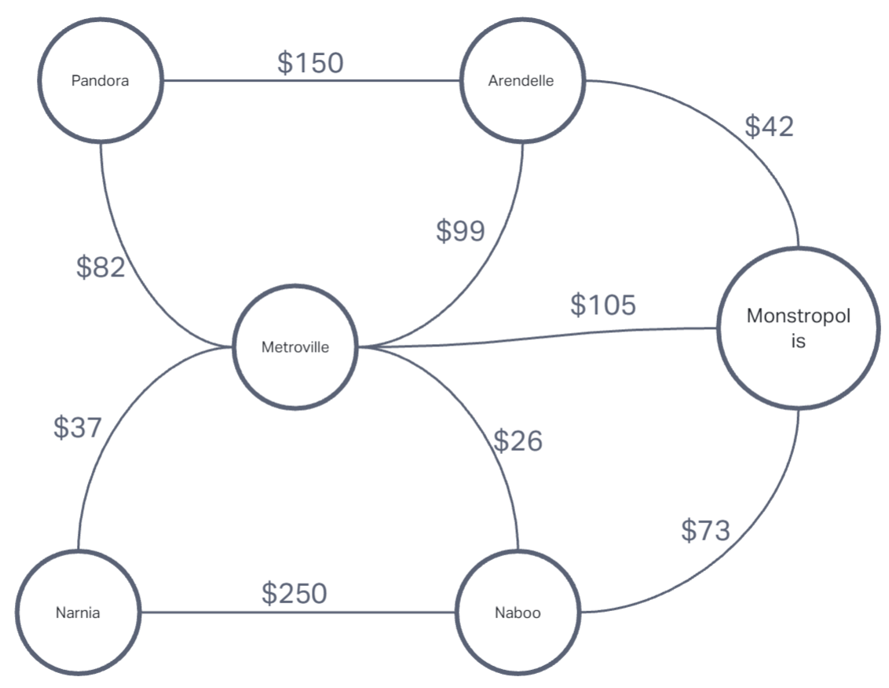

# graph-business-trip
- Given a business trip itinerary, and an Alaska Airlines route map, is the trip possible with direct flights? If so, how much will the total trip cost be?

## Whiteboard Process

## Approach & Efficiency
- ChatGPT

## Solution
function businessTrip(graph, cities) {
  let cost = 0;

  for (let i = 0; i < cities.length - 1; i++) {
    let route = graph[cities[i]].find(edge => edge.node === cities[i + 1]);
    if (!route) {
      return null; // Direct flight not found
    }
    cost += route.cost;
  }

  return cost;
}