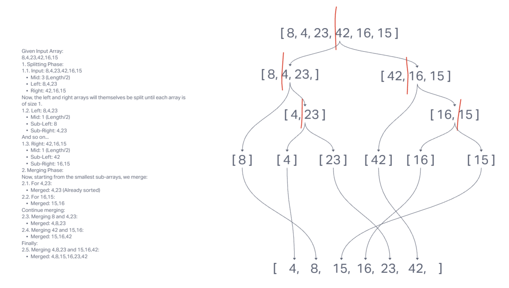

# Code Challenge 27, Merge Sort
Review the pseudocode below, then trace the algorithm by stepping through the process with the provided sample array. Document your explanation by creating a blog article that shows the step-by-step output after each iteration through some sort of visual.

## Whiteboard Process

## Approach & Efficiency
- Chatgpt, and Jacob Gave me a nice demo on the inclass whiteboard to follow along with :D

## Solution
- [Path To Code](./index.js)