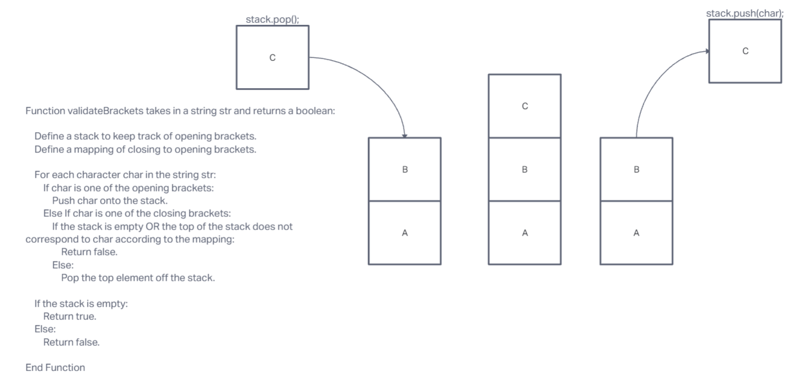

# Code Challenge: Class 13
### Feature Tasks
- Write a function called validate brackets
  - Arguments: string
  - Return: boolean
  - representing whether or not the brackets in the string are balanced

## Whiteboard Process

## Approach & Efficiency
I used ChatGPT to help me write and trouble shoot code. 

## Solution
function validateBrackets(str) {
    let stack = [];
    let map = {
        ')': '(',
        ']': '[',
        '}': '{'
    }

    for (let char of str) {
        if (char === '(' || char === '[' || char === '{') {
            stack.push(char);
        } else if (char === ')' || char === ']' || char === '}') {
            if (stack[stack.length - 1] === map[char]) {
                stack.pop();
            } else {
                return false;
            }
        }
    }
    
    return stack.length === 0;
}

// Examples
console.log(validateBrackets("{}")); // true
console.log(validateBrackets("{}(){}")); // true
console.log(validateBrackets("()[[Extra Characters]]")); // true
console.log(validateBrackets("(){}[[]]")); // true
console.log(validateBrackets("{}{Code}[Fellows](())")); // true
console.log(validateBrackets("[({}]")); // false
console.log(validateBrackets("(](")); // false
console.log(validateBrackets("{(})")); // false
