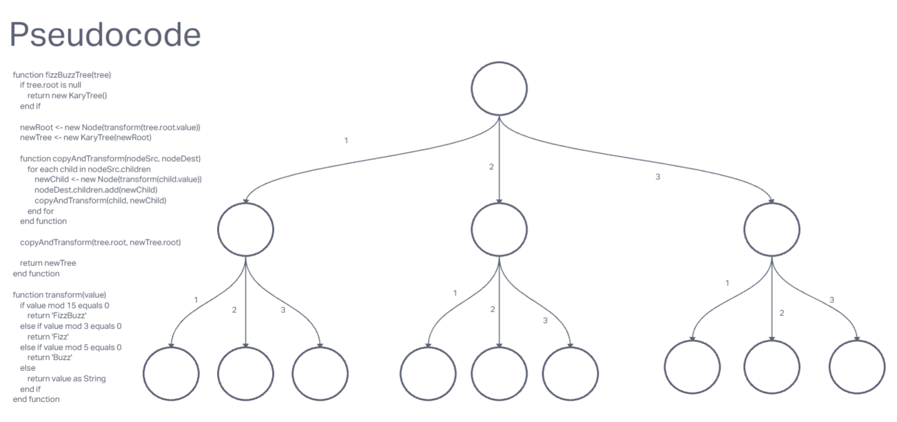

# Code Challenge: Class 18
Conduct “FizzBuzz” on a k-ary tree while traversing through it to create a new tree.

Set the values of each of the new nodes depending on the corresponding node value in the source tree.

## Whiteboard Process

## Approach & Efficiency
ChatGPT, Google Images/sites for ideas on howto whiteboard.

## Solution

class Node {
    constructor(value) {
        this.value = value;
        this.children = [];
    }
}

class KaryTree {
    constructor(root = null) {
        this.root = root;
    }
}

function fizzBuzzTree(tree) {
    if (!tree.root) {
        return null;
    }

    let newTree = new KaryTree(new Node(transformValue(tree.root.value)));

    function transformValue(value) {
        if (value % 15 === 0) {
            return "FizzBuzz";
        } else if (value % 3 === 0) {
            return "Fizz";
        } else if (value % 5 === 0) {
            return "Buzz";
        } else {
            return value.toString();
        }
    }

    function copyAndTransform(nodeSrc, nodeDest) {
        for (let child of nodeSrc.children) {
            let newChild = new Node(transformValue(child.value));
            nodeDest.children.push(newChild);
            copyAndTransform(child, newChild);
        }
    }

    copyAndTransform(tree.root, newTree.root);

    return newTree;
}

// Example usage:

let root = new Node(15);
root.children.push(new Node(3));
root.children.push(new Node(5));
root.children.push(new Node(2));

let tree = new KaryTree(root);
let newTree = fizzBuzzTree(tree);
